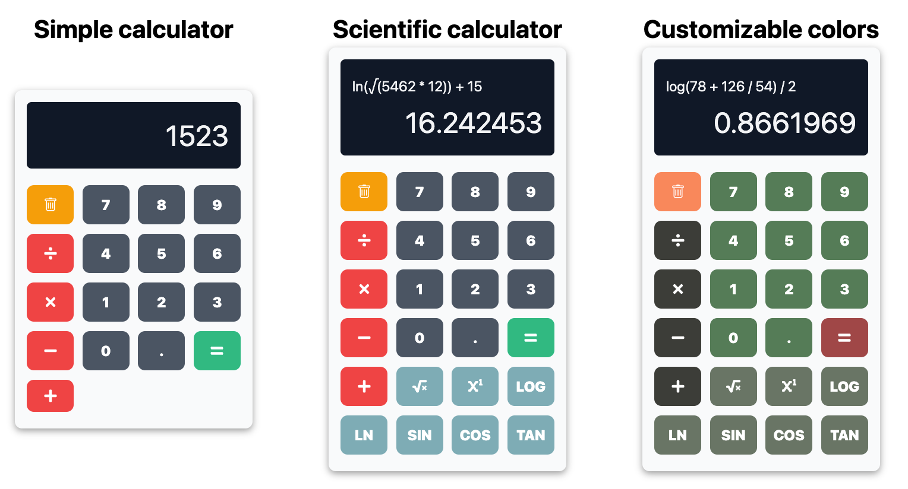

# 🎉 react-calculator-ts

**`react-calculator-ts`** is a simple and customizable calculator component built with TypeScript and React. It provides an easy-to-use interface for basic arithmetic operations and allows developers to customize button colors via component props.



## 🚀 Installation

To get started with **`react-calculator-ts`**, install it via npm by running the following command in your project directory:

```bash
npm install react-calculator-ts
```

## 📖 Usage

Here’s how to use **`react-calculator-ts`** in your React project.

### Example Code

```tsx
import React from 'react';
import ReactCalculator from 'react-calculator-ts';

// Example usage with optional props to customize button colors
const App = () => (
  <div>
    <h1>My Calculator</h1>
    <ReactCalculator 
      numberButtonColor="#34d399"      // Optional: Green color for number buttons
      operationButtonColor="#f97316"   // Optional: Orange color for operation buttons
      clearButtonColor="#3b82f6"       // Optional: Blue color for the clear button
    />
  </div>
);

export default App;
```

## 🛠️ Methods

### Customizable Props

The calculator component accepts the following optional props to customize the appearance:

- **`numberButtonColor` (String):** Hex or RGB color for the number buttons (optional, default is `#4b5563`).
- **`operationButtonColor` (String):** Hex or RGB color for the operation buttons (optional, default is `#ef4444`).
- **`clearButtonColor` (String):** Hex or RGB color for the clear button (optional, default is `#f59e0b`).

### Basic Operations

The calculator supports the following operations:

- **Addition (`+`)**
- **Subtraction (`-`)**
- **Multiplication (`*`)**
- **Division (`/`)**

### ⚙️ Component Options

- **`numberButtonColor` (String):** Color of the number buttons.
- **`operationButtonColor` (String):** Color of the operation buttons.
- **`clearButtonColor` (String):** Color of the clear button.

## 📌 Notes

This calculator is a basic, customizable arithmetic calculator designed for educational purposes or simple applications. Ensure that props are passed as valid CSS color strings (e.g., `#34d399`, `rgb(52, 211, 153)`).

## 🤝 Contributing

Contributions are welcome! If you have suggestions or improvements, please submit a pull request or open an issue on the project’s GitHub repository.

## 📄 License

This project is licensed under the **MIT License**. See the LICENSE file for more information.


[](https://codecov.io/gh/mon-utilisateur/react-calculator-ts)

## 👤 Authors

**Khalil MEQQORI** - Module Creator  
For more information or any questions, please open an issue on the GitHub repository or contact us at **meqqorikhalil@gmail.com**.
